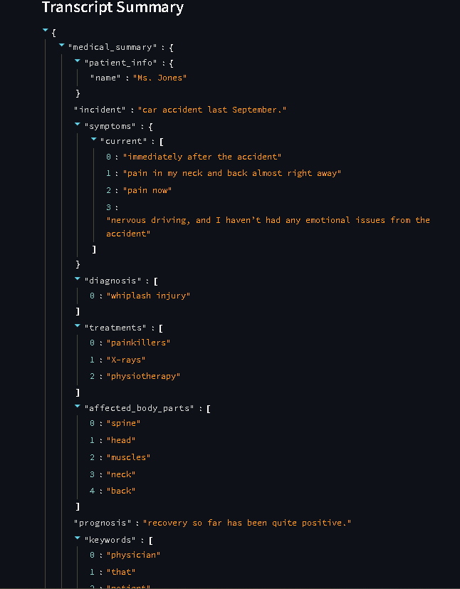
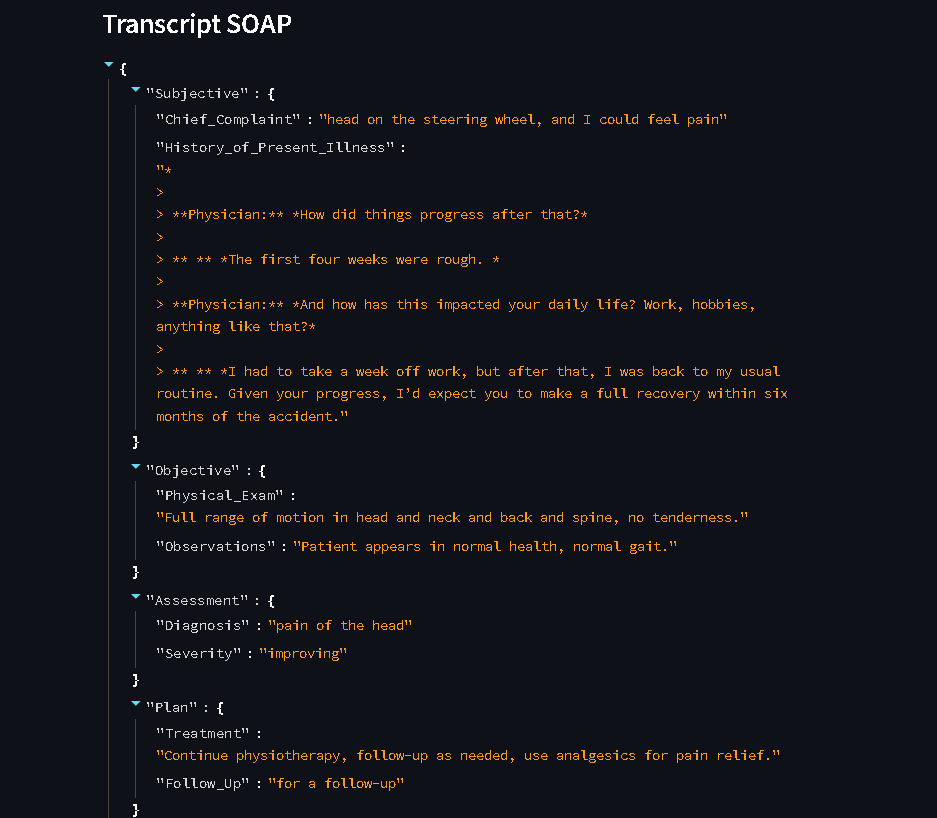

# 🩺 Physician Notetaker

## **Overview**
Physician Notetaker is an AI-driven application for **medical transcription, NLP-based summarization, and sentiment analysis**. It processes physician-patient conversations to extract structured medical insights, analyze patient sentiment, and generate SOAP notes.

## **Features**
✅ **Medical NLP Pipeline** - Extract key medical details such as symptoms, treatments, and diagnosis using NLP techniques.
✅ **Sentiment & Intent Analysis** - Detect patient sentiment (`Anxious`, `Neutral`, `Reassured`) and intent (`Seeking reassurance`, `Reporting symptoms`, `Expressing concern`).
✅ **SOAP Note Generation** - Convert medical conversations into structured SOAP notes (`Subjective`, `Objective`, `Assessment`, `Plan`).
✅ **Streamlit UI** - A user-friendly interface for real-time transcript analysis.

---

## **Setup & Installation**

### **1. Clone the Repository**
```sh
git clone https://github.com/VaibhavJain05/Physician_Notetaker.git
cd Physician_Notetaker
```

### **2. Create and Activate Virtual Environment**
```sh
python -m venv venv  # Create virtual environment
source venv/bin/activate  # On Mac/Linux
venv\Scripts\activate  # On Windows
```

### **3. Install Dependencies**
```sh
pip install -r requirements.txt
```

### **4. Download SpaCy Model**
```sh
python -m spacy download en_core_web_lg
```

### **5. Download Weights of Model**
download from the [link](https://drive.google.com/drive/folders/15-0eRYl-LCVGLbsSeQu4XJd3Fmx9jOCO?usp=drive_link) and save them in a folder names ./saved_folder


### **6. Run the Application**
```sh
streamlit run complete-solution.py
```

---

## **Project Components**

### **1️⃣ Medical NLP Pipeline** (`medical-nlp-pipeline.py`)
- Uses `spaCy` and `TF-IDF` for **Named Entity Recognition (NER)**.
- Extracts key medical details (`Symptoms`, `Diagnosis`, `Treatment`).
- Generates structured summaries in JSON format.

📌 **Example Output:**
```json
{
  "Symptoms": ["Neck pain", "Back pain", "Head impact"],
  "Diagnosis": "Whiplash injury",
  "Treatment": ["10 physiotherapy sessions", "Painkillers"],
  "Prognosis": "Full recovery expected within six months"
}
```

### **2️⃣ Sentiment & Intent Analysis** (`sentiment-analysis.py`)
- Utilizes `DistilBERT` for classifying patient **Sentiment** and **Intent**.

📌 **Example Output:**
```json
{
  "Sentiment": "Anxious",
  "Intent": "Seeking reassurance"
}
```

### **3️⃣ SOAP Note Generator** (`SOAP_generator.py`)
- Transforms physician-patient conversations into structured **SOAP notes**.

📌 **Example Output:**
```json
{
  "Subjective": {"Chief_Complaint": "Neck and back pain"},
  "Objective": {"Physical_Exam": "Full range of motion in cervical and lumbar spine"},
  "Assessment": {"Diagnosis": "Whiplash injury"},
  "Plan": {"Treatment": "Continue physiotherapy"}
}
```

---

## **Screenshots**




---

## **Methodologies Used**
### **Natural Language Processing (NLP)**
- **Named Entity Recognition (NER)** using `spaCy`.
- **TF-IDF** for keyword extraction.
- **DistilBERT** for sentiment and intent analysis.

### **Rule-based & ML Techniques**
- Rule-based heuristics for **SOAP Note generation**.
- Transformer-based approach for **Sentiment Classification**.

---

## **Contributing**
Feel free to fork the repository and submit **pull requests**. If you encounter any issues, open an **issue** on GitHub.

---

## **License**
This project is licensed under the **MIT License**.

---

## **Author**
👤 **Vaibhav Jain**
📌 [GitHub](https://github.com/VaibhavJain05)  |  📌 [LinkedIn](https://linkedin.com/in/vaibhavjain05)

